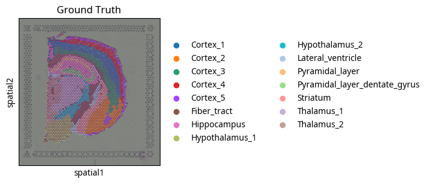
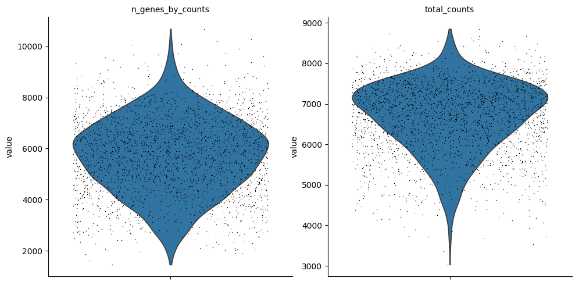
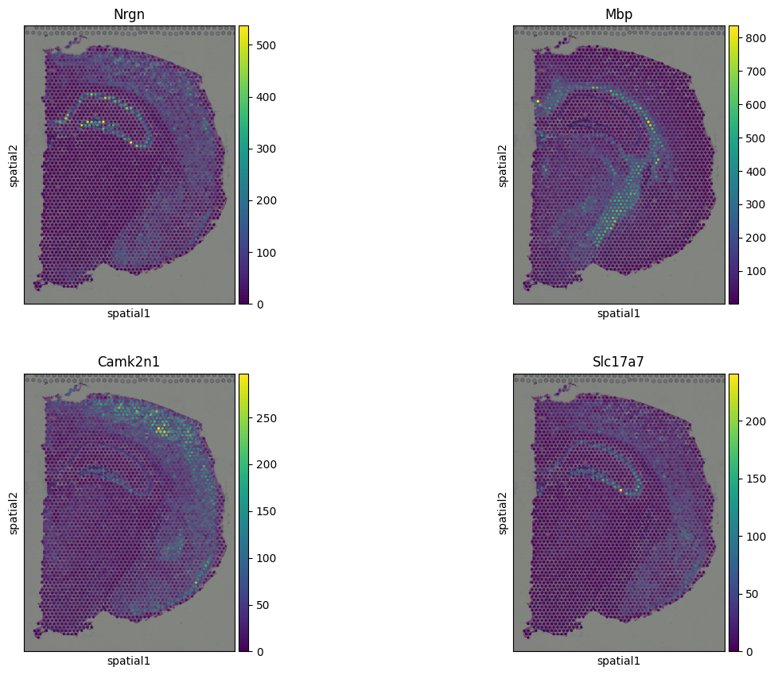
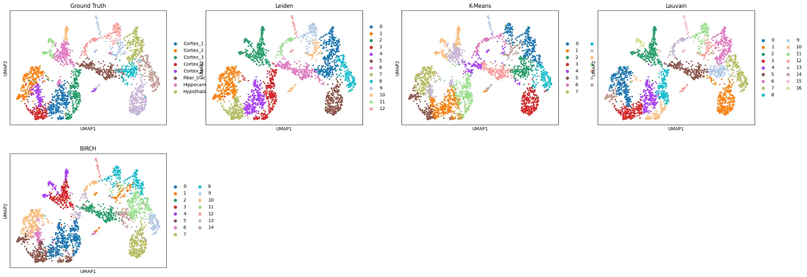
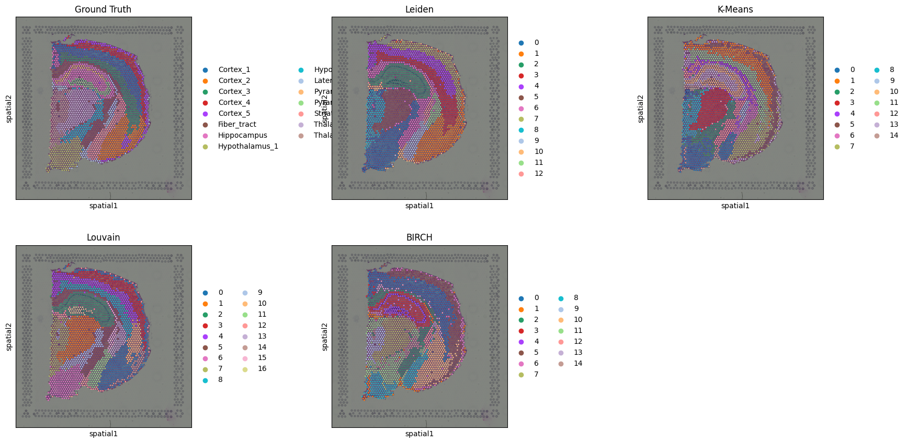
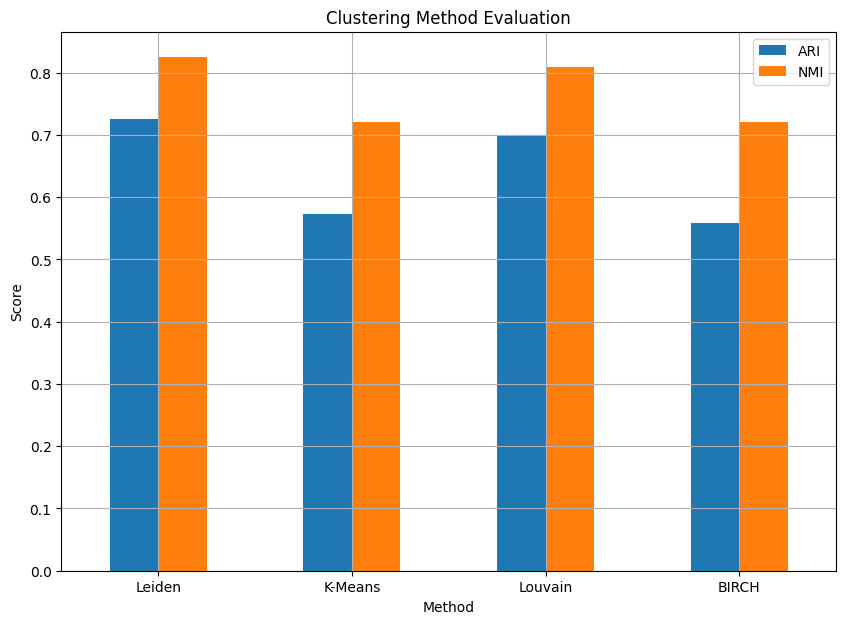

# 空間轉錄組學機器學習專案 (Spatial Transcriptomics ML Project)

## 專案概述

此專案旨在利用機器學習方法對空間轉錄組學數據進行全面的分析。空間轉錄組學技術能夠在保留組織形態信息的同時，測量組織切片中基因的表達水平，這為理解細胞異質性和組織微環境提供了前所未有的機會。本專案的核心是一個 Jupyter Notebook，它涵蓋了從數據加載、預處理、質量控制到空間自相關分析、降維以及多種聚類方法比較評估的完整工作流程。

透過本專案，我們展示了如何有效地處理和分析空間轉錄組學數據，識別具有空間模式的基因，並比較不同機器學習聚類算法在空間數據上的表現。最終目標是為研究人員提供一個清晰、可重複的分析框架，以從複雜的空間轉錄組學數據中提取生物學意義。

## 專案特色

*   **數據加載與預處理**：使用 `squidpy` 庫加載 Visium H&E 染色小鼠腦數據集，並進行基礎的數據清洗。
*   **質量控制 (QC)**：執行基因和細胞的過濾，並通過小提琴圖可視化關鍵質量指標。
*   **空間自相關分析**：利用 Moran's I 統計量識別具有顯著空間表達模式的基因。
*   **降維**：應用主成分分析 (PCA) 和 UMAP 進行數據降維，以便於可視化和聚類。
*   **多種聚類方法比較**：實現並比較 Leiden、K-Means、Louvain 和 BIRCH 等多種機器學習聚類算法。
*   **聚類性能評估**：使用調整蘭德指數 (ARI) 和歸一化互信息 (NMI) 等指標定量評估不同聚類方法的性能。
*   **豐富的可視化**：生成多種圖表，包括空間散點圖、UMAP 降維圖、小提琴圖和聚類評估條形圖，以直觀展示分析結果。


## 環境設置與依賴

本專案的運行需要 Python 環境，並依賴於以下庫。建議使用 `pip` 或 `conda` 進行安裝。

```bash
pip install scanpy squidpy numpy pandas matplotlib seaborn scikit-learn
pip install louvain igraph leidenalg
pip install gseapy
```

## 數據加載、預處理與質量控制 (Part 1)

### 1. 導入所需庫

專案首先導入了進行空間轉錄組學數據分析所需的各類 Python 庫，包括 `scanpy` 用於單細胞數據分析，`squidpy` 用於空間組學數據分析，以及 `numpy`, `pandas`, `matplotlib`, `seaborn`, `scikit-learn` 等常用數據處理和可視化庫。同時，程式碼會檢查並創建一個 `figures` 文件夾，用於保存所有生成的圖像。

### 2. 加載範例數據集

本專案使用 `squidpy` 提供的 Visium H&E 染色小鼠腦數據集作為範例。這是一個典型的空間轉錄組學數據集，包含基因表達矩陣和每個細胞點的空間坐標信息。數據加載後，會顯示原始數據的維度以及觀察點 (spots) 和變量 (genes) 的元數據概覽。

### 3. 可視化真實標籤 (Ground Truth)

數據集中包含一個預定義的 `cluster` 列，代表了組織的真實區域劃分。我們利用 `sq.pl.spatial_scatter` 函數將這些真實標籤在空間上進行可視化，生成一張顯示不同細胞群體在組織切片上實際位置的圖像。這張圖將作為後續聚類結果比較的基準。



### 4. 數據質量控制 (QC) 與基因表達統計分析

質量控制是空間轉錄組學數據分析的關鍵步驟。本專案執行以下 QC 步驟：

*   **計算 QC 指標**：使用 `sc.pp.calculate_qc_metrics` 計算每個細胞點的基因數量、總讀取數等指標。
*   **細胞過濾**：移除基因數量過少的細胞點 (例如，少於 200 個基因)，以排除低質量或空載的細胞點。
*   **基因過濾**：移除在過少細胞點中表達的基因 (例如，少於 3 個細胞點)，以排除低表達或非特異性表達的基因。

隨後，通過小提琴圖 (`sc.pl.violin`) 展示 `n_genes_by_counts` (每個細胞點的基因數量) 和 `total_counts` (每個細胞點的總讀取數) 的分佈，以評估數據的質量和過濾效果。




## 空間自相關分析

空間自相關分析旨在識別在空間上呈現非隨機分佈模式的基因。這對於理解組織結構和功能區域的形成至關重要。本專案使用 Moran's I 統計量來量化基因表達的空間自相關性。

### 1. 計算空間鄰居圖

首先，使用 `sq.gr.spatial_neighbors` 函數構建空間鄰居圖。這個圖定義了哪些空間點 (spots) 在物理上是相鄰的，通常基於它們的坐標距離。這裡採用 `coord_type="grid"` 和 `n_neighs=6`，表示每個點與其最近的 6 個鄰居相連，模擬網格狀的空間關係。

### 2. 計算 Moran's I 值

接著，對所有高變異基因計算 Moran's I 值。Moran's I 是一個衡量空間自相關性的指標，其值範圍從 -1 (負相關) 到 1 (正相關)。正值表示相似的基因表達值傾向於聚集在一起，而負值表示不相似的基因表達值傾向於聚集。`n_perms=100` 用於計算 p 值，以評估觀察到的 Moran's I 值是否顯著。

### 3. 可視化高空間自相關基因

分析結果會顯示 Moran's I 值最高的基因。這些基因被認為在空間上具有最強的聚集模式。專案會選取 Moran's I 值最高的幾個基因，並使用 `sc.pl.spatial` 函數將它們的空間表達模式可視化。這有助於直觀地觀察這些基因在組織切片上的分佈，進一步理解其潛在的生物學功能。




## 數據歸一化、特徵選擇與降維

為了準備數據進行聚類分析，需要進行一系列的數據轉換步驟，包括歸一化、特徵選擇和降維。

### 1. 數據歸一化與對數轉換

*   **總讀取數歸一化**：使用 `sc.pp.normalize_total(adata, target_sum=1e4)` 將每個細胞點的總讀取數歸一化到一個常數 (例如 10,000)，以消除測序深度差異帶來的影響。
*   **對數轉換**：接著，應用 `sc.pp.log1p(adata)` 進行對數轉換 (log(1+x))，這有助於穩定數據的方差，使基因表達分佈更接近正態分佈，從而改善下游分析的性能。

### 2. 特徵選擇 (高變異基因)

並非所有基因都對區分細胞類型或空間區域有貢獻。選擇高變異基因 (Highly Variable Genes, HVGs) 可以減少數據的維度，同時保留最重要的生物學信息。本專案使用 `sc.pp.highly_variable_genes` 函數，根據基因的平均表達量和方差來識別 HVGs。過濾後，數據集將只包含這些高變異基因，進一步降低了計算複雜性。

### 3. 降維 (PCA 和 UMAP)

高維數據難以直接可視化和分析，因此需要降維技術。

*   **主成分分析 (PCA)**：首先，使用 `sc.tl.pca(adata, svd_solver='arpack')` 執行 PCA。PCA 是一種線性降維方法，它將數據投影到一組正交的主成分上，這些主成分捕獲了數據中最大的方差。這有助於去除數據中的冗餘信息。
*   **鄰居圖構建**：在 PCA 降維後的空間中，使用 `sc.pp.neighbors(adata, n_neighbors=10, n_pcs=40)` 構建細胞點之間的鄰居圖。這個圖是許多圖形基礎聚類算法 (如 Leiden 和 Louvain) 的基礎。
*   **UMAP 降維**：最後，應用 `sc.tl.umap(adata)` 進行統一流形近似與投影 (UMAP)。UMAP 是一種非線性降維技術，它能夠更好地保留數據的全局和局部結構，非常適合於高維生物學數據的可視化。UMAP 投影後的二維或三維空間常用於展示細胞群體的聚類結果。


## 多種聚類方法比較 (Part 2)

本專案比較了四種不同的機器學習聚類算法在空間轉錄組學數據上的表現：Leiden、K-Means、Louvain 和 BIRCH。這些算法各有特點，適用於不同的數據結構和分析目標。

### a. Leiden 聚類

Leiden 算法是一種基於圖優化的聚類方法，它旨在發現網絡中的社區結構。它通常比 Louvain 算法產生更精細和更高質量的聚類結果。本專案使用 `sc.tl.leiden(adata, resolution=0.5, key_added='leiden')` 進行聚類，其中 `resolution` 參數控制聚類的粒度。

### b. K-Means 聚類

K-Means 是一種經典的基於質心的聚類算法，它將數據點劃分到 K 個預定義的簇中，使得每個數據點都屬於離它最近的質心。本專案中，K 值設定為真實標籤的類別數量，並對 PCA 降維後的數據 (`adata.obsm['X_pca']`) 進行聚類。

### c. Louvain 聚類

Louvain 算法是另一種流行的基於圖的社區檢測算法，它通過優化模塊度來發現網絡中的聚類。它通常用於處理大規模數據集，並能有效地識別層次結構。本專案使用 `sc.tl.louvain(adata, key_added='louvain')` 進行聚類。

### d. BIRCH 聚類

BIRCH (Balanced Iterative Reducing and Clustering using Hierarchies) 是一種層次聚類算法，它能夠有效地處理大型數據集，通過構建聚類特徵樹 (CF-tree) 來逐步聚類。本專案中，BIRCH 的簇數量也設定為真實標籤的類別數量，並對 PCA 降維後的數據進行聚類。


## 數據可視化與聚類性能評估 (Part 3)

在執行完多種聚類方法後，本專案將對這些方法的結果進行可視化比較和定量評估，以判斷它們在空間轉錄組學數據上的表現。

### 1. 可視化比較

可視化是理解聚類結果最直觀的方式。本專案生成了兩種主要的可視化圖表：

*   **UMAP 降維圖比較**：使用 `sc.pl.umap` 函數，將真實標籤 (Ground Truth) 與 Leiden、K-Means、Louvain 和 BIRCH 聚類結果在 UMAP 降維空間中進行比較。這有助於觀察不同聚類算法在低維空間中對細胞群體結構的保留和劃分能力。

    

*   **空間散點圖比較**：使用 `sq.pl.spatial_scatter` 函數，將真實標籤與各聚類結果在原始空間坐標上進行可視化。這直接展示了不同聚類算法在組織切片上劃分區域的準確性和合理性，可以直觀地看到哪些算法的聚類結果與生物學上的真實區域更吻合。

    

### 2. 定量評估比較

除了視覺比較，本專案還採用了兩種常用的定量指標來評估聚類算法的性能：

*   **調整蘭德指數 (Adjusted Rand Index, ARI)**：ARI 衡量了兩個聚類結果之間的一致性，考慮了隨機機會的影響。其值範圍從 -1 (不一致) 到 1 (完全一致)。ARI 越高，表示聚類結果與真實標籤越吻合。

*   **歸一化互信息 (Normalized Mutual Information, NMI)**：NMI 衡量了兩個聚類結果之間共享的信息量，也考慮了隨機機會。其值範圍從 0 (無共同信息) 到 1 (完全一致)。NMI 越高，表示聚類結果與真實標籤的相關性越強。

這些指標的計算結果將被整理成一個 DataFrame，並打印輸出，以便於比較。最後，本專案會生成一個條形圖，直觀地展示不同聚類方法在 ARI 和 NMI 上的得分，從而提供一個清晰的性能對比。




